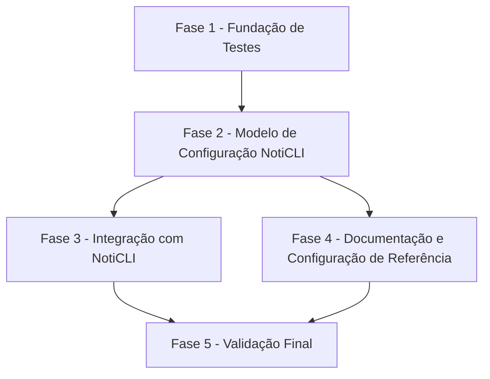

# Tarefas vaultGFS - NotiCLI Backup Notifications

Escopo: implementar notificações opcionais de resultado de backup via NotiCLI, com configuração TOML global e por job, overrides para falhas, chamada externa ao executável `noticli` no PATH, logs diagnósticos e testes.

**Legenda de status:**
- `[ ]` Pendente
- `[~]` Em andamento
- `[x]` Concluído
- `[!]` Bloqueado

**Legenda de criticidade:**
- `[C]` Crítico - Impacto financeiro direto, regulatório, segurança, SLA ou operação bloqueante
- `[A]` Alto - Funcionalidade essencial
- `[M]` Médio - Necessário, mas sem urgência imediata

---

## FASE 1 - Fundação de Testes

### 1.1 Preparar suíte automatizada `[A]`

Ref: plan.md §Technical Context; research.md Decision 5

- [x] 1.1.1 Adicionar configuração de testes Python ao projeto.
- [x] 1.1.2 Criar estrutura `tests/` para testes de configuração, notificação e CLI.
- [x] 1.1.3 Validar que a suíte inicial executa sem depender de NotiCLI real.

### 1.2 Cobrir comportamento atual antes da integração `[A]`

Ref: plan.md §Project Structure; spec.md User Stories 1-4

- [x] 1.2.1 Adicionar teste de carregamento básico da configuração TOML existente.
- [x] 1.2.2 Adicionar teste de validação de job existente para proteger regressões.
- [x] 1.2.3 Adicionar teste de CLI com job desabilitado ou stubado para preservar retorno atual.

---

## FASE 2 - Modelo de Configuração NotiCLI

### 2.1 Definir estrutura TOML de notificação `[A]`

Ref: spec.md FR-001-FR-009, FR-020, FR-022; research.md Decision 1

- [x] 2.1.1 Definir formato global de `notifications.noticli` ou equivalente no `config.toml.model`.
- [x] 2.1.2 Definir formato por job com default e failure-specific usando a mesma estrutura sem duplicação desnecessária.
- [x] 2.1.3 Atualizar documentação de configuração com exemplos globais e por job.

### 2.2 Implementar validação de configuração `[A]`

Ref: spec.md FR-018; checklist requirements CHK009

- [x] 2.2.1 Validar tipos básicos e campos obrigatórios quando NotiCLI estiver habilitado.
- [x] 2.2.2 Validar canais suportados pelo NotiCLI conforme contrato documentado.
- [x] 2.2.3 Validar sender, recipient, title e message efetivos quando aplicável.
- [x] 2.2.4 Adicionar testes para configurações válidas, incompletas e desabilitadas.

### 2.3 Implementar resolução de precedência `[A]`

Ref: spec.md FR-003-FR-007; data-model.md Effective Notification Settings

- [x] 2.3.1 Criar resolvedor de configurações efetivas para sucesso, falha e skip.
- [x] 2.3.2 Aplicar precedência de job failure, job default, global failure e global default.
- [x] 2.3.3 Respeitar desabilitação explícita por job mesmo com configuração global habilitada.
- [x] 2.3.4 Adicionar testes cobrindo overrides parciais e herança de defaults.

---

## FASE 3 - Integração com NotiCLI

### 3.1 Criar módulo de notificação `[A]`

Ref: plan.md §Project Structure; research.md Decision 4

- [x] 3.1.1 Criar `src/vaultgfs/notification.py` com tipos internos simples para evento, settings e resultado.
- [x] 3.1.2 Implementar renderização padrão de título e mensagem com contexto de execução.
- [x] 3.1.3 Implementar construção do comando `noticli send` conforme contrato.
- [x] 3.1.4 Adicionar testes de renderização e command line sem executar processo real.

### 3.2 Implementar envio e captura de diagnóstico `[A]`

Ref: spec.md FR-011-FR-017, FR-024; contracts/noticli-invocation.md

- [x] 3.2.1 Executar `noticli send` como subprocesso resolvido pelo PATH.
- [x] 3.2.2 Capturar exit code, stdout, stderr e erros locais como executável ausente.
- [x] 3.2.3 Garantir que falhas de notificação retornem resultado diagnóstico sem levantar erro para o backup.
- [x] 3.2.4 Adicionar testes para sucesso, exit code diferente de zero e executável ausente.

### 3.3 Integrar notificação ao ciclo do backup `[A]`

Ref: spec.md User Story 4; cli_backup.py lifecycle; quickstart.md Scenarios 1-5

- [x] 3.3.1 Ajustar `cli_backup.py` para determinar status final antes do retorno.
- [x] 3.3.2 Enviar notificação após execução, inclusive quando o job falhar por exceção.
- [x] 3.3.3 Preservar retorno original do backup mesmo quando NotiCLI falhar.
- [x] 3.3.4 Evitar notificação duplicada para uma única execução.
- [x] 3.3.5 Adicionar testes de CLI provando preservação de status e envio único.

### 3.4 Implementar logs diagnósticos seguros `[A]`

Ref: spec.md FR-015-FR-017; checklist requirements CHK020

- [x] 3.4.1 Definir formato de log para notification sent, skipped e failed.
- [x] 3.4.2 Redigir ou evitar valores com padrão de segredo em diagnósticos.
- [x] 3.4.3 Incluir job, tipo de notificação, canal, recipient e exit code quando disponível.
- [x] 3.4.4 Adicionar testes que confirmem presença de diagnóstico e ausência de segredo óbvio.

---

## FASE 4 - Documentação e Configuração de Referência

### 4.1 Atualizar `config.toml.model` `[M]`

Ref: spec.md FR-021-FR-022; quickstart.md Scenarios 1-3

- [x] 4.1.1 Adicionar exemplo global de NotiCLI desabilitado por padrão.
- [x] 4.1.2 Adicionar exemplo de configuração failure-specific.
- [x] 4.1.3 Adicionar exemplo de override por job mantendo valores sensíveis fora do repositório.

### 4.2 Atualizar documentação do projeto `[M]`

Ref: spec.md SC-006; docs/requirements.md Future roadmap alerts

- [x] 4.2.1 Documentar a nova seção de configuração no README.
- [x] 4.2.2 Atualizar `docs/requirements.md` para mover alerts/NotiCLI de roadmap para comportamento especificado.
- [x] 4.2.3 Documentar que NotiCLI deve estar no PATH e que falhas de notificação não alteram o backup.

---

## FASE 5 - Validação Final

### 5.1 Executar suíte e validações manuais `[A]`

Ref: quickstart.md Scenarios 1-5; checklist requirements CHK022-CHK024

- [x] 5.1.1 Rodar testes automatizados completos.
- [x] 5.1.2 Executar cenário com fake NotiCLI retornando sucesso.
- [x] 5.1.3 Executar cenário com fake NotiCLI retornando falha e confirmar status do backup preservado.
- [x] 5.1.4 Revisar logs produzidos para confirmar diagnóstico suficiente e sem segredos.

### 5.2 Sincronizar backlog e artefatos SDD `[M]`

Ref: dev-pipeline task synchronization; plan.md; spec.md

- [x] 5.2.1 Marcar subtarefas concluídas com evidência quando implementadas.
- [x] 5.2.2 Revisar spec, plan, contracts e quickstart contra a implementação final.
- [x] 5.2.3 Registrar qualquer escopo excluído ou decisão emergente no documento adequado.

---

## Matriz de Dependências

## Resumo Quantitativo

| Fase | Tarefas | Subtarefas | Criticidade |
|------|---------|------------|-------------|
| 1 - Fundação de Testes | 2 | 6 | A |
| 2 - Modelo de Configuração NotiCLI | 3 | 11 | A |
| 3 - Integração com NotiCLI | 4 | 17 | A |
| 4 - Documentação e Configuração de Referência | 2 | 6 | M |
| 5 - Validação Final | 2 | 7 | A, M |
| **Total** | **13** | **47** | - |

## Escopo Coberto

| Item | Descrição | Fase |
|------|-----------|------|
| S1 | Notificações globais opcionais por NotiCLI | 2, 3 |
| S2 | Overrides por job e failure-specific | 2, 3 |
| S3 | Chamada externa a `noticli send` pelo PATH | 3 |
| S4 | Falha de notificação sem impacto no status do backup | 3, 5 |
| S5 | Logs diagnósticos seguros para falhas de notificação | 3, 5 |
| S6 | Configuração de referência e documentação de uso | 4 |
| S7 | Testes automatizados e cenários com fake NotiCLI | 1, 5 |

## Escopo Excluído

| Item | Descrição | Motivo |
|------|-----------|--------|
| X1 | Implementar ou empacotar o NotiCLI | NotiCLI é dependência operacional externa disponível no PATH. |
| X2 | Criar daemon, scheduler ou fila nova para notificações | A feature usa o ciclo existente de execução de backups. |
| X3 | Persistir histórico próprio de notificações no banco | Logs são suficientes para esta feature; o catálogo segue focado em backups. |
| X4 | Suporte a anexos NotiCLI | Não é necessário para o MVP de resultado de backup e depende de canal. |
